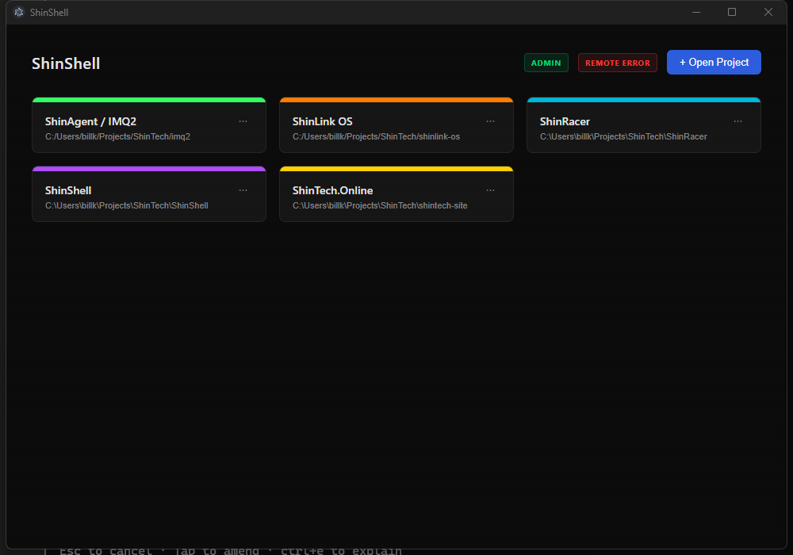
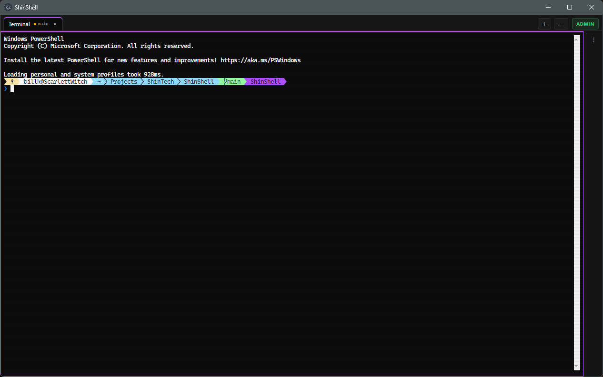
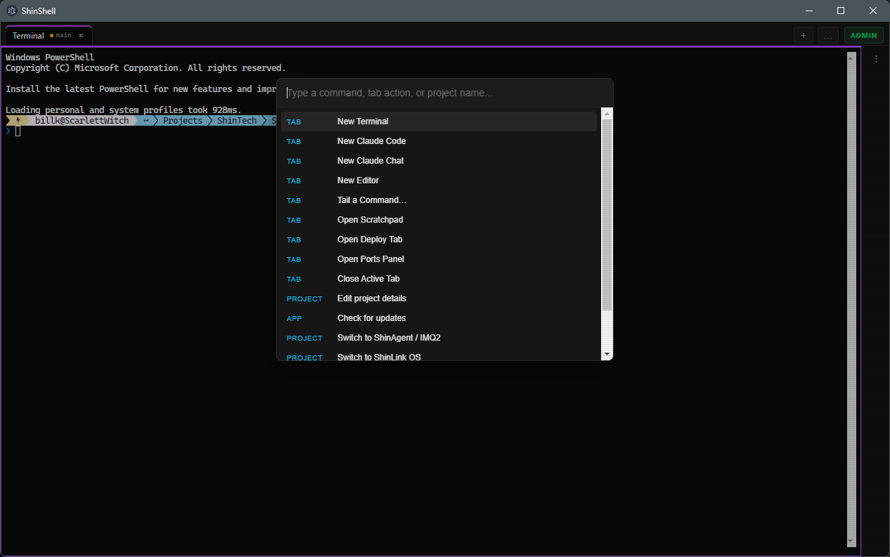
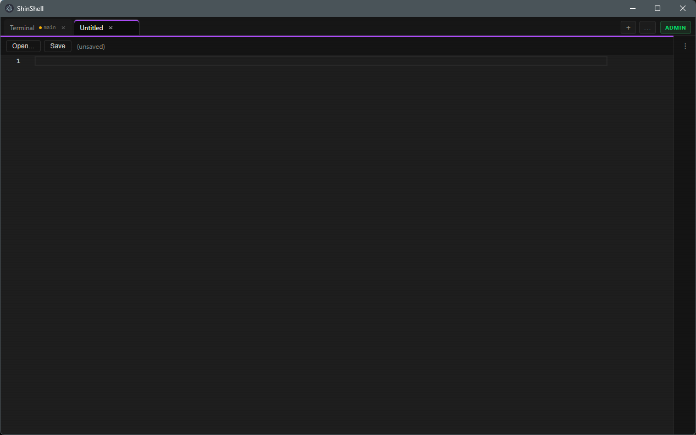

# ShinShell

**One elevated window to rule them all.**

ShinShell exists because I once had six PowerShell windows open, all of them
titled "Windows PowerShell," and confidently piped a deploy command into the wrong
one. If you have ever restarted the wrong service, `git push`ed from the wrong repo,
or watched a command execute in a terminal you *swore* was pointed at the Pi —
this app is for you. This app is for us.

It's a Windows desktop shell that consolidates the whole ShinTech dev loop —
PowerShell terminals, Claude chat, an editor, and one-keystroke deploys to the Pi —
into **color-coded project windows** so you always, *always* know which project
you're about to break.

- **Dev machine:** Windows 11 Pro
- **Prime deploy target:** shinobi, a Raspberry Pi 5 that has seen things
- **Dev root:** a local `ShinTech\` folder with sibling repos (`imq2/`, `shinlink-os/`, `AC1Companion/`)
- **Status:** Phase 0 (discovery) complete ✅ — building toward M1

> **For Claude Code:** this file is the authoritative brief. `docs/DISCOVERY.md`
> holds the Phase 0 inventory and its resolved answers. Sibling repos are
> reference-only — look, don't touch.

---

## Install

Grab the latest `ShinShell-Setup-<version>.exe` from
[Releases](https://github.com/ShinobiFPV/ShinShell/releases/latest) and run it.
We don't code-sign, so the first launch gets a SmartScreen "unrecognized app"
screen — **More info → Run anyway**. Every launch after that is silent
(§ Elevation). Already installed? It checks for updates on its own; see
docs/DEPLOYING.md if you want to force one or ship a new version.

---

## Screenshots

| Launcher | Terminal |
|---|---|
|  |  |

| Command palette | Editor |
|---|---|
|  |  |

---

## The pitch

Every open project gets its **own OS window**, tinted with that project's accent
color, with a matching colored dot on the taskbar icon. Inside each window: tabs.

| Tab type | What it is |
|---|---|
| `terminal` | Real `pwsh.exe` via ConPTY. Oh-My-Posh renders untouched. Splits supported. |
| `claude-code` | A terminal preset that just runs `claude` in the project dir. |
| `claude-chat` | claude.ai in an embedded browser, session persists across restarts. |
| `editor` | Monaco — the literal VS Code editor component, not a sad textarea. |
| `scratchpad` | Auto-saved per-project markdown for notes and "don't forget" lists. |
| `log-tail` | SSH into the Pi and watch logs scroll by. Very soothing. |
| `deploy` | Big deploy button, flag toggles, streamed output, SSH health light. |

And the whole app runs **persistently elevated with zero UAC prompts** (§ Elevation),
because clicking "Yes" forty times a day builds no character whatsoever.

If you're about to type a deploy command and the window chrome is *green*, you're
talking to Q2. If it's *papaya*, hands off the CRSF hardware. That's the entire
thesis of this application.

---

## Architecture

| Layer | Choice | Why |
|---|---|---|
| Shell | **Electron + React + TypeScript** | Same stack as AC1Companion; known territory |
| Terminal | **xterm.js + node-pty** | The VS Code combo. ConPTY → real pwsh → Oh-My-Posh just works |
| Browser tab | **WebContentsView** | Persistent session partition; Chrome user-agent override so Google OAuth doesn't sulk |
| Editor | **Monaco** | Free VS Code editor, zero excuses |
| File watch | **chokidar** | For watch-and-sync mode |
| Config | JSON in `%APPDATA%/ShinShell/` | Human-editable, portable |
| Packaging | **electron-builder** (NSIS) | AC1Companion already proved this pipeline |
| Updates | **electron-updater** + GitHub Releases | Feed is the `publish` block in `package.json`; NSIS installer replay means `customInstall` (scheduled task) re-registers on update too, not just fresh installs |

Rules of the road: all pty/fs work in the main process, typed IPC channels to the
renderer, PowerShell 7 (`C:\Program Files\PowerShell\7\pwsh.exe`) as the default
shell spawned with the normal profile so Oh-My-Posh loads exactly like standalone.
xterm.js WebGL renderer on, fit addon handling resizes.

---

## Elevation: admin forever, prompts never

The trick is a **Windows Scheduled Task**:

1. The installer (elevated once) registers task `ShinShell` — *Run with highest
   privileges*, trigger on demand, action: launch the app.
2. The desktop/taskbar shortcut runs `schtasks /run /tn "ShinShell"` — the app
   launches elevated and UAC never says a word.
3. If the task is missing (new machine, someone got tidy), the app detects it's
   not elevated and offers a one-click self-repair.
4. A small **ADMIN** badge lives in the UI at all times, because silent power is
   how accidents happen.

**The honest tradeoff:** *everything* inherits admin — terminals, Claude Code,
the embedded browser. Also, Windows UIPI blocks drag-and-drop from non-elevated
Explorer into elevated windows, so there's a proper Open File dialog instead.
We accept this. We accepted it the fortieth time UAC asked if we were sure.

That inheritance is also what makes silent self-updates work: the app only
ever runs elevated (via the scheduled task), so the installer
`quitAndInstall` spawns for an update inherits the same elevated token —
no UAC prompt mid-update, same as every other launch.

Rebuilding/reinstalling? See docs/DEPLOYING.md.

---

## Features

### P0 — the reason this exists

1. **Terminals** — unlimited pwsh tabs per project, opened in the project dir,
   Oh-My-Posh intact, copy/paste, search, splits, font config.
2. **Project windows** — color-coded per the table above, taskbar overlay dots
   (`setOverlayIcon`), in-app project create/edit.
3. **Claude chat tab** — persistent login, back/forward/reload, external links
   punt to the default browser.
4. **Editor + scratchpad** — Monaco with open/save into the project tree.
5. **Hotkey command system** — see Hotkeys below.
6. **Zero-prompt elevation** — see above.
7. **Session restore** — kill the app, relaunch, everything comes back
   (windows, tabs, working dirs; scrollback gets to die).

### P1 — the quality of life

8. **Log-tail tab** — runs *any configured SSH command* (learned in Phase 0:
   neither main app uses systemd, so no journalctl assumptions). Q2 logs to
   `imq2/logs/imq2.log`; ShinLink's ground station logs to
   `/home/shinobi/shinlink_os.log`. `tail -f` is the workhorse; journalctl is
   only for the Pi-Zero vehicle services. Reconnect button, connection state dot.
9. **Deploy tab + SSH health** — deploy button with **flag toggles** (checkboxes
   for `-dryrun` / `-restart` instead of a hotkey per permutation), streamed
   output, deploy history (last 20 runs, exit codes, durations), and a health
   light that TCP-pokes port 22 on the primary target every ~15s.
10. **Port/process panel** — lists listening ports, filterable, per-row kill.
    Ports named in project configs get highlighted, and any port claimed by
    **two** projects gets a special cross-project collision warning — a class
    of bug we discovered *while writing this spec* (UDP 8000: imq2's Forza
    listener vs. Watchtower's APRS feed, same Pi 🎉). Resolution: APRS moves
    to **8010**; 8000–8003 is telemetry's block now, no squatters.
11. **Global summon** — Ctrl+` toggles the most recent project window,
    quake-style.

### P2 — the victory lap

12. **Watch-and-sync** — chokidar on configured globs → deploy on save,
    debounced. The dev loop becomes *save and it's on the Pi*.
13. **Command palette** — Ctrl+Shift+P fuzzy search over every saved command,
    tab action, and project. Also home to deliberately-hotkey-less commands
    like `Publish shinagent (public sanitized)` — some things should require
    intent.
14. **Git status in tab strip** — branch + dirty dot per project.
15. **Theming** — dark default, ShinTech/H9000 aesthetic encouraged, readability
    beats vibes.

**Non-goals for v1:** SSH multiplexing UI (just spawn `ssh` in a pty), plugins,
macOS/Linux, tray-only mode, settings sync. Scope creep is how apps die young.

---

## ShinShell Remote

A phone PWA that turns "is Claude Code sitting at a permission prompt while
I'm away from the desk" into a glance instead of a walk back to the office —
and, for the few other things worth doing from the couch, a guarded way to
do them without opening a laptop.

**Off by default.** Enabling it (Launcher → the REMOTE badge) starts a small
HTTPS+WebSocket server inside ShinShell that binds **only** to this
machine's Tailscale interface address — never your LAN, never the open
internet. If Tailscale isn't up, Remote refuses to start rather than
silently doing something else. HTTPS comes from `tailscale cert`, which
requires "HTTPS Certificates" turned on for your tailnet in the
[admin console](https://login.tailscale.com/admin/dns) — see
docs/DEPLOYING.md if that step is new to you. The REST/WS API is versioned
(`/api/v1/…`); the PWA embeds the ShinShell version it was built alongside
and warns loudly if a stale service-worker-cached app shell ever talks to a
server that's since moved on, rather than failing in some more confusing way.

**Pairing:** the settings panel shows a QR code (open it on the phone) and,
on demand, a 6-digit PIN that expires in 5 minutes and locks out after 5
wrong guesses. The phone submits the PIN once and gets a long-lived device
token. Paired devices are listed (and revocable) from *either* side — the
desktop settings panel, or the phone's own Settings → Paired devices, which
also names which entry is "this device."

**Home screen — Mission Control.** One card per open project, in its accent
color: aggregate state (WAITING pulse / BUSY spinner / IDLE) across that
project's Claude Code tabs, how long it's been in that state, the last
couple of output lines so a glance is often enough to decide whether to dig
in further, and an SSH dot for the project's primary target. A slim footer
shows ShinShell's own version/uptime/hostname. This is what a WAITING push
notification opens into. Tapping a card opens that project's session view;
from there, every other pty-backed tab (log-tail especially — watching Q2's
logs from the couch) is reachable too, in a clearly-labeled **view only**
mode — input stays Claude-Code-only unless the desktop's
`allowFullTerminalInput` escape hatch is on.

**Session view:** pinch-to-zoom or A-/A+ for font size (persisted per
device), proper scrollback with a "jump to live" pill once you've scrolled
up, a configurable quick-action row (the default
`[Enter][Esc][↑][↓][y][n]` plus whatever snippets you add in Settings —
long-press any of them to see exactly what they send), and a text field
with local send-history and a multiline toggle for longer replies.

**Push notifications** fire once per WAITING *episode* (a session flapping
busy→waiting→busy→waiting twice in quick succession gets two pushes, not
one swallowed by a cooldown) via a plain outbound call to Apple/Google's
push service — that part works over any network, not just the tailnet; only
*opening* the notification needs you back on Tailscale. Where the platform
renders notification actions (Chrome/Android; iOS Safari doesn't support
them at all, so it falls back to tap-to-open there), **y**/**n**/**Open**
buttons let you answer a prompt straight from the lock screen — the service
worker POSTs the key itself, no window ever opens. Per-device (not global)
project mute list and a quiet-hours window, editable from the phone's own
Settings — per-device because push subscriptions already are; a tablet on
the desk might want everything audible while a phone wants one project and
no 2am pings. **iOS note:** push only works from a PWA added to the Home
Screen (Share → Add to Home Screen) on iOS 16.4+ — a normal Safari tab
can't subscribe at all; the app says so inline on first launch.

**Remote deploy — opt-in, guarded.** A separate desktop toggle,
`remote.allowDeploy` (default **off**), gates whether a project's deploy
commands (the same set the desktop's own Deploy tab exposes) even appear on
its card. Non-dangerous ones fire on tap; dangerous ones arm first — a 3s
accent-color countdown naming exactly what's about to run and where, second
tap within the window confirms — the identical pattern as the desktop's
own arm-to-confirm. A triggered run streams into a read-only view and pushes
a green/red result notification on completion.

**Connection UX:** an application-level WS heartbeat (server pings every
4s; the client force-reconnects if ~10s pass with nothing at all, rather
than waiting on the OS to notice a half-dead socket) backs the existing
exponential-backoff reconnect, surfaced as a ribbon that distinguishes
"still trying" from "actually broken" by elapsed time — past ~15s down it
names the moment things broke instead of repeating "reconnecting" forever.
The last successful project list and health check are cached on-device, so
a cold launch with no connectivity paints the last-known dashboard
(clearly timestamped as stale) instead of a blank screen.

Everything except the phone itself lives in this repo: the server in
`src/main/remote/`, the PWA in `/remote` (its own subproject — Preact +
xterm.js, built separately and served by ShinShell itself, see
`npm run build:remote`).

---

## Project config

One JSON per project in `%APPDATA%/ShinShell/projects/`. Real defaults for all
three projects live in `docs/DISCOVERY.md` §2 (extracted from the actual repos,
not vibes). The shape:

```jsonc
{
  "id": "imq2",
  "name": "IMQ2 / Q2",
  "accentColor": "#33FF66",
  "workingDir": "C:/Users/YOUR_USERNAME/Projects/ShinTech/imq2",
  "shell": "pwsh.exe",
  "env": {},
  "targets": [
    { "id": "shinobi",    "label": "Pi 5 (shinobi) — LAN",       "host": "shinobi",    "user": "shinobi", "port": 22, "healthCheck": true  },
    { "id": "shinobi-ts", "label": "Pi 5 (shinobi) — Tailscale", "host": "shinobi-ts", "user": "shinobi", "port": 22, "healthCheck": false }
  ],
  "commands": [
    { "id": "deploy",         "label": "Deploy to Pi",       "command": "./deploy.ps1",          "hotkey": "Ctrl+1",       "runIn": "new-tab" },
    { "id": "deploy-restart", "label": "Deploy + Restart Q2","command": "./deploy.ps1 -restart", "hotkey": "Ctrl+Shift+1", "runIn": "new-tab", "dangerous": true },
    { "id": "logs",           "label": "Tail Q2 logs",       "command": "ssh {targets.shinobi.host} tail -n 50 -f imq2/logs/imq2.log", "hotkey": "Ctrl+2", "runIn": "new-tab" },
    { "id": "attach",         "label": "Attach Q2 tmux",     "command": "ssh -t {targets.shinobi.host} 'cd imq2 && bash scripts/q2_attach.sh'", "hotkey": "Ctrl+5", "runIn": "new-tab" }
  ],
  "watchSync": { "enabled": false, "globs": ["**/*.py"], "ignore": ["**/__pycache__/**", "**/.git/**", "**/.venv/**"], "onChange": "deploy", "debounceMs": 1500 },
  "ports": [8000, 8001, 8002, 8003, 8091, 8092, 8095, 8765, 8766, 8767],
  "restore": { "tabs": [] },
  "lastKnownGitRemote": "git@github.com:ShinobiFPV/imq2.git"
}
```

Command strings support `{targets.<id>.<field>}`, `{workingDir}`, and
`{env.<NAME>}` substitution. `runIn` is `new-tab` | `active-terminal` |
`background`. Targets accept hostnames or IPs (Pi Zeros use dynamic Tailscale
hostnames, so they'll be added ad hoc with `healthCheck: false`). Commands
marked `"dangerous": true` don't fire on the first keypress — see
**arm-to-confirm** in the UX section. `lastKnownGitRemote` is written
automatically on every successful window open (§UX8) — it's what ranks
rename-recovery suggestions when `workingDir` goes missing, not something
you're expected to hand-edit.

**Seed drift:** a project's config is only ever copied from these defaults
once, into a brand-new (empty) `%APPDATA%/ShinShell/projects/` — after that
it's the user's file, and `ensureSeeded()` never touches it again. So a field
added to a default command later (like `deploy-restart`'s `dangerous: true`)
still reaches an install that already has that project on disk,
`getProject`/`listProjects` backfill any command field present in the seed
but missing from the saved copy, matched by command id. Never overwrites a
field — or an explicit override like `"dangerous": false` — the user's copy
already has, and never resurrects a command the user deleted.

**SSH convention (decided in Phase 0):** aliases everywhere. `~/.ssh/config`
defines `Host shinobi` (LAN) and `Host shinobi-ts` (Tailscale); ShinShell
configs and both projects' `deploy.ps1` reference the alias. Hardcoded IPs are
how you end up deploying to a router. Note the Pi user is `shinobi`, not your
Windows login — the machines have callsigns too.

---

## Hotkeys

Two scopes, one philosophy: same slot = same *kind* of action in every project,
so muscle memory transfers.

**Global (OS-wide):**

| Key | Action |
|---|---|
| Ctrl+` | Summon/hide most recent project window |
| Ctrl+Alt+1..9 | Jump to project N |
| Ctrl+Alt+T | New terminal in active project |

**Project-scoped (per the configs):**

| Key | imq2 | shinlink-os | AC1Companion |
|---|---|---|---|
| Ctrl+1 | Deploy to Pi | Deploy to Pi | Deploy |
| Ctrl+Shift+1 | Deploy + restart Q2 | Deploy (dry run) | — |
| Ctrl+2 | Tail Q2 logs | Tail ground station log | — |
| Ctrl+3 | Q2 status (tmux) | *(reserved)* | — |
| Ctrl+4 | Restart Q2 (tmux) | *(reserved)* | — |
| Ctrl+5 | Attach Q2 tmux | *(reserved)* | — |

Plus the usual: Ctrl+T new tab, Ctrl+W close, Ctrl+Tab cycle. All bindings
editable, with conflict detection. Commands can either execute in a new tab or
be **injected into the active terminal without pressing Enter** — typed but not
fired, cursor at the end, for the trust-but-verify crowd.

One deliberate exception: `shinlink-os` gets **no remote "run" hotkey**. The
ground station is a Tkinter GUI driving real GPIO (CPPM/S.BUS/CRSF) on the Pi's
attached display. You do not launch that over SSH. You walk over to it like a
gentleman.

---

## UX details (the anti-wrong-window kit)

The design test for everything in this section: does it *reinforce knowing where
you are*, or *reduce keystrokes you already type*? If neither, it doesn't ship.
These aren't features — they're guardrails on the features above.

1. **Color where your eyes actually are.** Window chrome is easy to tune out
   once a terminal is full-screen, so the accent color follows your focus: a
   thin accent strip along the top of every tab's content area, and — the
   sneaky one — an env var (`SHINSHELL_PROJECT`, `SHINSHELL_ACCENT`) injected
   into every pty so an Oh-My-Posh segment renders the project name, in the
   project color, **inside the prompt itself**. You look at the prompt when
   you type. That's where the guardrail lives.
2. **Arm-to-confirm on dangerous commands.** Commands flagged `dangerous: true`
   don't fire on the hotkey — they *arm*. The deploy button pulses in the
   accent color showing exactly what's loaded ("Deploy + Restart Q2 →
   shinobi"), and the same key confirms within 3 seconds or it disarms. One
   extra keystroke, only where the wrong-window mistake actually hurts.
   Regular deploys stay one-touch.
3. **Outcomes without babysitting.** Deploys are long enough to tab away from:
   `setProgressBar` on the taskbar icon while running, then a toast + brief
   taskbar flash on completion — green or red. A failed run also leaves its
   tab glowing red until it's been looked at. Exit code 1 does not get to
   scroll quietly into history.
4. **Hotkey sidebar.** Ctrl+1–5 means different things per project *by
   design*, so the bindings live in a **collapsible sidebar** instead of
   cluttering the top of the window: a slim icon rail on the right edge that
   expands on **Ctrl+/** (or clicking the rail) into a panel listing the
   current project's commands — hotkey, label, target — in the project's
   accent color, with `dangerous` commands marked. Rows are clickable (click =
   run, same arm rules apply), so it doubles as a mouse-friendly command list
   for the dev buddies. Auto-collapses on Esc or refocusing the terminal;
   pinnable open for learning week. Collapsed, it's ~40px of icons; the
   terminal keeps the real estate.
5. **A health light that earns its tooltip.** The SSH dot stays binary at a
   glance, but hovering it answers the whole "is the Pi okay" question:
   round-trip latency, LAN vs. Tailscale resolution, time since last
   successful deploy, and that deploy's exit code.
6. **Tab titles that describe state, not type.** "Terminal 2" tells you
   nothing; `~/imq2 (main*)` — cwd + git branch + dirty marker — is
   orientation. Log-tail tabs surface connected/reconnecting state in the
   title.
7. **Color-first quick-switch.** Holding Ctrl+Alt pops a strip of colored
   project chips — alt-tab, but switching is a *color choice* instead of
   reading window titles. Same thesis, smallest possible form.
8. **Path validation + edit dialog.** A project's `workingDir` isn't
   guaranteed to still be there — folders get renamed, drives get
   unmounted. Every registered project is checked (app launch, window
   open, and again on launcher/window focus) without ever throwing; a
   missing folder swaps a launcher card's open button for a warning +
   **Fix path…**, and disables new tabs/commands/deploys/watch-sync in an
   already-open window (existing terminals keep running — their ptys don't
   care) with a toast pointing at the fix. **Edit project details**
   (kebab menu on a card, gear icon in the project window's hotkey panel,
   or the command palette) covers name/accent/workingDir/shell/env, with
   live path validation and a native folder picker. When the path's
   broken, the dialog scans its old parent directory and offers up to 3
   "did you mean?" candidates — ranked by git remote match, then name
   similarity, then recency — and clicking one applies *and saves* in a
   single click, since a plain rename-in-place is the common case.

Build priority if it comes down to it: prompt indicator (1) → arm-to-confirm
(2) → completion toasts (3). Those three attack the founding mistake directly.

---

## Milestones

Each milestone runs end-to-end before the next begins. Commit per milestone.

- **M0 — Discovery** ✅ `docs/DISCOVERY.md` written, all 11 questions answered.
- **M1 — Terminal core:** shell + xterm.js/node-pty tabs, Oh-My-Posh verified
  pixel-identical to standalone pwsh, splits, terminal session restore.
- **M2 — Projects & windows:** config schema, launcher window, per-project
  windows, accent colors, taskbar dots, accent content strips, and the
  `SHINSHELL_*` env vars + Oh-My-Posh prompt segment (UX 1).
- **M3 — Elevation & packaging:** NSIS installer, scheduled-task registration,
  zero-prompt elevated launch verified, ADMIN badge. (Crib from AC1Companion's
  electron-builder setup.)
- **M4 — Commands & hotkeys:** saved commands, variable substitution, both
  hotkey scopes, injection mode, arm-to-confirm for `dangerous` commands
  (UX 2), collapsible hotkey sidebar (UX 4).
- **M5 — Claude & editor tabs:** claude-chat WebContentsView with OAuth verified,
  claude-code preset, Monaco + scratchpad.
- **M6 — Pipeline features:** deploy tab with flag toggles, SSH health with
  rich tooltip (UX 5), completion toasts + taskbar progress + red failed-tab
  glow (UX 3), log-tail, port panel with collision warnings, stateful tab
  titles (UX 6).
- **M7 — Polish:** watch-and-sync, command palette, git status, color-first
  quick-switcher (UX 7), theming, README.

---

## Definition of "it works"

- [ ] Taskbar click → elevated window in <3s, UAC silent
- [ ] `whoami /groups` shows elevated; Oh-My-Posh prompt identical to standalone pwsh
- [ ] Two projects open = two windows, unmistakably different colors, distinguishable in the taskbar
- [ ] Ctrl+1 in the green window deploys Q2; Ctrl+1 in the papaya window deploys ShinLink — *and you can tell which is which before you press it* (the entire point)
- [ ] Claude tab stays signed in across app restarts
- [ ] Force-kill the app → relaunch restores every window, tab, and working dir
- [ ] Pull the Pi's ethernet → SSH light goes red within ~30s
- [x] The prompt itself shows the project name in the project color — full-screen terminal, chrome invisible, you still know where you are
- [ ] Ctrl+Shift+1 arms (does not fire) Deploy + Restart; second press within 3s fires it; waiting disarms it
- [ ] A failed deploy leaves visible evidence (red tab glow + toast) even if you were in another window when it died
- [ ] Ctrl+/ expands the hotkey sidebar to a clickable command list in the project's accent color; clicking into a terminal (or Esc) collapses it again unless pinned
- [ ] Everything except the Claude tab and remote features works offline

### Layout contract + responsive resizing (layout pass)

- [x] Top bar contains exactly three things — tab strip, SSH health dot, ADMIN badge — nothing else in `.tab-strip-row`'s component tree
- [x] Tab strip never wraps to a second row; scrolls horizontally with overflow arrows once tabs don't fit, arrows only appear when there's actually overflow
- [x] Hotkey sidebar is a flex sibling of the tab content, not an overlay: expanding/collapsing/pinning it visibly resizes the content area, and every mounted terminal reflows (confirmed via `pty.resize` firing and the container's measured width changing)
- [x] Usable at 1080p landscape, 4K landscape, 1080×1920 portrait, and a narrow 800px window — no clipped controls, no overlap, no horizontal scrollbar on the document in portrait
- [x] Terminal resize is debounced (~50ms) off a ResizeObserver; split-pane dividers clamp to a minimum pane size (~20 cols / 6 rows) instead of an arbitrary ratio
- [ ] Drag the window between two different-DPI monitors → prompt stays crisp (re-fit + redraw wired to the window's `moved` event and `display-metrics-changed`/scaleFactorChanged; not yet manually verified on real mixed-DPI hardware)
- [ ] Window position/size persists per window (keyed by project id) and restores on the correct monitor when it's still attached, falling back to a default position when it isn't (implemented; not yet verified across an actual monitor unplug/replug)
- [x] Minimum window size (640×480) enforced on both the launcher and project windows

### Path validation + edit dialog (rename recovery)

- [x] Rename a project's folder while ShinShell is closed → launch → the launcher card shows a warning + "Fix path…" (no open button); the edit dialog's "did you mean?" ranks the renamed folder first via git remote match; one click applies and saves; the card immediately opens normally and window chrome (title, accent) is correct
- [x] Rename a project's folder while its window is open → existing terminal(s) keep running untouched; attempting a new tab is blocked with a toast pointing at Edit project details, surfacing on the next window focus (no polling)
- [x] A bad/missing workingDir never throws past pty spawn, background commands, or watch-sync start — verified via the above (no crash, just a graceful block + log line)

### GitHub Releases distribution + update check

- [x] Tagging `v*` and pushing produces a published GitHub Release with exactly three assets — `ShinShell-Setup-<version>.exe`, `.exe.blockmap`, `latest.yml` — via `.github/workflows/release.yml` alone, no hand-uploaded installer
- [x] A packaged build finds a newer published release on startup (10s delay), prompts "Update now / Remind me next launch" with real release notes, and the manual "Check for updates" command palette entry gives feedback either way (up to date / error) while the automatic check stays silent on both
- [x] "Update now" downloads with taskbar progress and installs silently, then **relaunches elevated with zero UAC prompt** — verified live end-to-end (real tag → real Release → real install → real self-update → High integrity, `Task To Run` still correct) after finding and fixing two real bugs in the process: electron-builder's own post-install launch silently drops elevation (worked around by relaunching via `schtasks /run` instead), and the obvious "does the scheduled task already exist" signal for detecting a reinstall is always false in practice because the assisted NSIS installer deletes the task moments earlier during its own silent uninstall-previous-version step (fixed by keying off `%APPDATA%\ShinShell\app-state.json` instead)
- [x] Dev builds (`app.isPackaged` false) never touch the updater at all

### Clipboard (copy/paste)

- [ ] Copy text from Notepad (non-elevated) → Ctrl+V into a terminal tab lands correctly; a single-line paste goes through instantly, no prompt
- [ ] Pasting a clipboard payload with 2+ lines shows an inline "Paste N lines?" confirm over that pane; Cancel does nothing, Paste sends it; the confirm's "Don't ask again" checkbox persists and is honored on the next multiline paste
- [ ] Right-click in a terminal with no selection pastes; right-click with an active selection copies and clears the selection — no popup menu either way
- [ ] Ctrl+C with a selection copies (and clears it); Ctrl+C with no selection still interrupts a running command; Ctrl+Shift+C always copies when there's a selection
- [ ] Ctrl+A inside a live PowerShell prompt still moves the cursor to line start (not swallowed by the app's hidden Edit menu)
- [ ] Ctrl+V works in the Monaco editor tab, the scratchpad, and plain dialog inputs (e.g. Edit Project Details' Name field)
- [ ] Right-click in Monaco/the scratchpad still shows Monaco's own native menu (not doubled); right-click in the claude-chat tab shows a Cut/Copy/Paste menu

### ShinShell Remote

All of the below build clean (`tsc --noEmit` on both the desktop app and
`remote/`, plus real `vite build`/`electron-vite build` runs) but are not
yet exercised on a real phone over Tailscale — that's the actual bar for
checking these off, not a clean build.

- [ ] Two projects open, one Claude Code prompt waiting in each → both Mission Control cards update live (state dot, time-in-state, last-output lines) within one poll cycle, and the SSH dot reflects a real pulled Ethernet cable within ~30s
- [ ] Tapping a WAITING push notification's **y**/**n** action (Chrome/Android) advances a real Claude Code prompt without the app ever opening; tapping the notification body itself (or on iOS, where actions don't render) opens straight into that session
- [ ] A project's log-tail tab is reachable from its session view, clearly labeled "view only," streaming real `tail -f` output with no input bar present
- [ ] With `remote.allowDeploy` on: a dangerous deploy command arms on first tap (3s accent countdown, correct host shown), fires on the second tap within the window, streams real output into a read-only view, and a completion push (green/red) arrives with the right exit code
- [ ] Kill ShinShell → the app shows the offline ribbon, then "ShinShell offline since HH:MM" past ~15s, with the dashboard still showing the last-known cards (timestamped, not blank); relaunch ShinShell → the app reconnects unaided within a few seconds of the heartbeat/backoff loop noticing
- [ ] Font size persists across an app restart on the same device; pinch-to-zoom and the A-/A+ buttons agree with each other
- [ ] A custom quick-action snippet added in Settings appears in the session view immediately (no reload) and long-press previews its literal payload before sending
- [ ] Paired-devices screen (phone Settings) correctly flags "this device" and revoking a *different* device logs it out without affecting the current session; revoking *this* device logs the current phone out too
- [ ] iOS Safari (not yet added to Home Screen) shows the install banner on first load; after Add to Home Screen, push notifications actually arrive

## House rules (for Claude Code)

- Ask before adding dependencies beyond the architecture table.
- Sibling repos are **read-only reference**. The one-commit fixes noted in
  Phase 0 (shinlink deploy.ps1 alias, APRS → 8010, stale README path) happen
  in *those* repos, separately — not smuggled in here.
- No secrets in the repo. SSH rides the existing key setup; do not build
  password storage.
- Windows-only. Every hour spent on cross-platform abstraction is an hour the
  deploy button doesn't exist.
- When unsure how something actually works, check the sibling repos first,
  then ask before proceeding. The repos remember; humans improvise.
